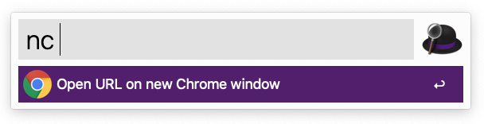
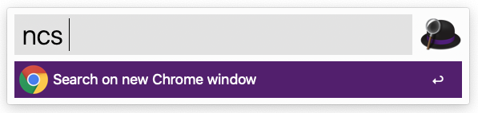

# New Chrome window workflow

A workflow to open new Chrome window to open a URL or source on Google. 

Hope to help those who have opened many workspaces like me.

## New Chrome (nc) ##

Open URL on new Chrome window. Empty URL then just open a new Chrome window.

**Keyword: nc**

## New Chrome Search (ncs) ##

Open a new Chrome window and search on Google.

**Keyword: ncs**

# Thanks

- Inspired by [caiogondim' s Repo](https://github.com/caiogondim/alfred-chrome-window-workflow)

- AppleScript from [user3439894' s answer](https://apple.stackexchange.com/questions/312551/open-urls-in-new-chrome-window)